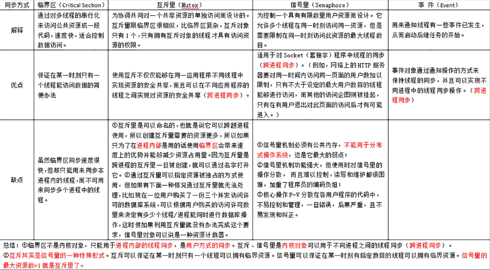

## 进程

### 资源分配的基本单位

### 进程同步方式

### 进程间通信方式

- 消息传递：消息传递是**进程间实现通信和同步等待的机制**，使用消息传递，进程间的交流不需要共享变量，直接就可以进行通信；消息传递分为发送方和接收方
- 先进先出队列：先进先出队列指的是两个不相关联进程间的通信，两个进程之间可以彼此相互进程通信，这是一种全双工通信方式
- **管道**：管道用于两个相关进程之间的通信，这是一种半双工的通信方式，如果需要全双工，需要另外一个管道。
- 直接通信：在这种进程通信的方式中，进程与进程之间只存在一条链接，进程间要明确通信双方的命名。
- 间接通信：间接通信是通信双方不会直接建立连接，而是找到一个中介者，这个中介者可能是个对象等等，进程可以在其中放置消息，并且可以从中删除消息，以此达到进程间通信的目的。
- **消息队列**：消息队列是内核中存储消息的链表，它由消息队列标识符进行标识，这种方式能够在不同的进程之间提供全双工的通信连接。
- 共享内存：共享内存是使用所有进程之间的内存来建立连接，这种类型需要同步进程访问来相互保护。

### 进程上下文与切换

CPU 寄存器，是 CPU 内置的容量小、但速度极快的内存。而程序计数器，则是用来存储 CPU 正在执行的指令位置、或者即将执行的下一条指令位置。它们都是 CPU 在运行任何任务前，必须的依赖环境，因此也被叫做 CPU 上下文。

CPU 上下文切换，就是先**把前一个任务的 CPU 上下文（也就是 CPU 寄存器和程序计数器）保存起来**，然后**加载新任务的上下文到这些寄存器和程序计数器**，最后再**跳转到程序计数器所指的新位置，运行新任务**。而这些保存下来的上下文，会存储在系统内核中，并在任务重新调度执行时再次加载进来。

#### 发生上下文切换场景

1. 为了保证所有进程可以得到公平调度，CPU 时间被划分为一段段的时间片，这些时间片再被轮流分配给各个进程。这样，当某个进程的**时间片耗尽**了，就会被系统挂起，切换到其它正在等待 CPU 的进程运行。
2. 进程在**系统资源不足**（比如内存不足）时，要等到资源满足后才可以运行，这个时候进程也会被挂起，并由系统调度其他进程运行。
3. 当进程通过睡眠函数 sleep 这样的方法将自己**主动挂起**时，自然也会重新调度。
4. 当有**优先级更高的进程运行**时，为了保证高优先级进程的运行，当前进程会被挂起，由高优先级进程来运行
5. 发生硬件**中断**时，CPU 上的进程会被中断挂起，转而执行内核中的中断服务程序。

#### 系统调用

从用户态到内核态的转变，需要通过系统调用来完成。比如，当我们查看文件内容时，就需要多次系统调用来完成：首先调用 open() 打开文件，然后调用 read() 读取文件内容，并调用 write() 将内容写到标准输出，最后再调用 close() 关闭文件。

在这个过程中就发生了 CPU 上下文切换，整个过程是这样的：
 1、保存 CPU 寄存器里原来用户态的指令位
 2、为了执行内核态代码，CPU 寄存器需要更新为内核态指令的新位置。
 3、跳转到内核态运行内核任务。
 4、当系统调用结束后，CPU 寄存器需要恢复原来保存的用户态，然后再切换到用户空间，继续运行进程。

所以，**一次系统调用的过程，其实是发生了两次 CPU 上下文切换**。（用户态-内核态-用户态）

#### 进程上下文切换跟系统调用区别

首先，进程是由内核来管理和调度的，**进程的切换只能发生在内核**态。所以，进程的上下文不仅包括了虚拟内存、栈、全局变量等用户空间的资源，还包括了内核堆栈、寄存器等内核空间的状态。

因此，进程的上下文切换就比系统调用时多了一步：在保存内核态资源（当前进程的内核状态和 CPU 寄存器）之前，需要先把该进程的用户态资源（虚拟内存、栈等）保存下来；而加载了下一进程的内核态后，还需要刷新进程的虚拟内存和用户栈。

如下图所示，保存上下文和恢复上下文的过程并不是“免费”的，需要内核在 CPU 上运行才能完成。

### 孤儿、僵尸进程

#### **孤儿进程：**

**一个父进程退出，而它的一个或多个子进程还在运行，那么那些子进程将成为孤儿进程。孤儿进程将被init进程(进程号为1)所收养，并由init进程对它们完成状态收集工作。**

#### **僵尸进程：**

**一个进程使用fork创建子进程，如果子进程退出，而父进程并没有调用wait或waitpid获取子进程的状态信息，那么子进程的进程描述符仍然保存在系统中。这种进程称之为僵死进程。**

**问题及危害**

如果进程不调用wait / waitpid的话，那么保留的那段信息就不会释放，其进程号就会一直被占用，但是系统所能使用的进程号是有限的，如果大量的产生僵死进程，将因为**没有可用的进程号而导致系统不能产生新的进程. 此即为僵尸进程的危害**，应当避免。

孤儿进程是没有父进程的进程，**孤儿进程这个重任就落到了init进程身上,因此孤儿进程并不会有什么危害**。任何一个子进程(init除外)在exit()之后，并非马上就消失掉，而是留下一个称为僵尸进程(Zombie)的数据结构，等待父进程处理。

#### 避免僵尸进程的方法：

1.一般僵尸进程很难直接kill掉，不过您可以kill僵尸爸爸。父进程死后，僵尸进程成为”孤儿进程”，过继给1号进程init，init始终会负责清理僵尸进程．它产生的所有僵尸进程也跟着消失。

2.用wait()函数使父进程阻塞:wait函数将使其调用者阻塞，直到其某个子进程终止。故父进程可调用wait函数回收其僵尸子进程。除此之外，waitpid函数提供更为详尽的功能( 增加了非阻塞功能以及指定等待功能 )

3.使用信号量，在signal handler 中调用waitpid,这样父进程不用阻塞:子进程死后，会发送SIGCHLD信号给父进程，父进程收到此信号后，执行waitpid()函数为子进程收尸。就是基于这样的原理：就算父进程没有调用wait，内核也会向它发送SIGCHLD消息，而此时，尽管对它的默认处理是忽略，如果想响应这个消息，可以设置一个处理函数。

## 线程

### 线程同步方式

- 互斥量`pthread_mutex_`
- 读写锁`pthread_rwlock_`
- 条件变量`pthread_cond_`
- 信号量`sem_`

### 线程间通信方式

- 共享内存
- 消息传递
- 信号量
- 条件变量
- 互斥锁

### 线程上下文切换

内核中的任务调度，实际上的调度对象是线程；而进程只是给线程提供了虚拟内存、全局变量等资源。

所以，对于线程和进程，我们可以这么理解：

- 当进程只有一个线程时，可以认为进程就等于线程。
- 当进程拥有多个线程时，这些线程会共享相同的虚拟内存和全局变量等资源。这些资源在上下文切换时是不需要修改的。
- 另外，线程也有自己的私有数据，比如栈和寄存器等，这些在上下文切换时也是需要保存的。

这么一来，线程的上下文切换其实就可以分为两种情况：

- 第一种， 前后**两个线程属于不同进程**。此时，因为资源不共享，所以切换过程就**跟进程上下文切换是一样**。
- 第二种，前后两个线程属于**同一个进程**。此时，因为虚拟内存是共享的，所以在切换时，虚拟内存这些资源就保持不动，**只需要切换线程的私有数据、寄存器等不共享的数据**。

虽然同为上下文切换，但同进程内的线程切换，要比多进程间的切换消耗更少的资源，而这，也正是多线程代替多进程的一个优势。