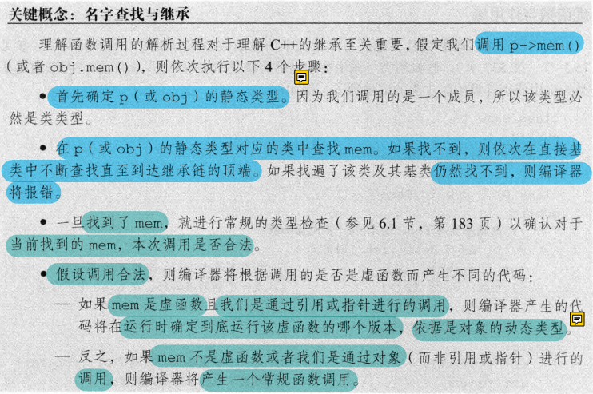
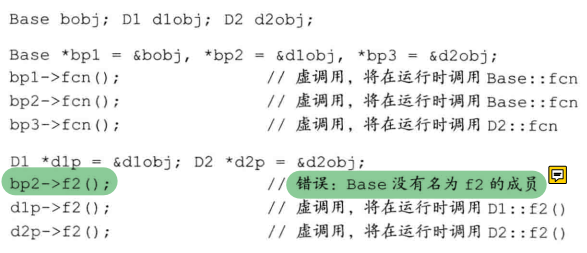
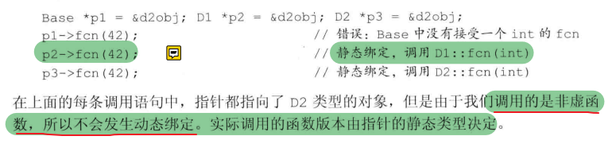

### 重载

a. 重载是指不同的函数使用相同的函数名，但是函数的参数个数或类型不同（参数列表不同）。调用的时候根据函数的参数来区别不同的函数，函数重载跟返回值无关。

b. 重载的规则 - 函数名相同 - 必须具有不同的参数列表 - 可以有不同的访问修饰符

c. 重载用来实现静态多态（函数名相同，功能不一样）。

d. 重载是多个函数或者同一个类中方法之间的关系，是平行关系。

### 重写（覆盖）

a. 重写（也叫覆盖）是指在派生类中重新对基类中的虚函数重新实现。即函数名和参数都一样，只是函数的实现体不一样。 

b. 重写的规则： - 方法声明必须完全与父类中被重写的方法相同 - 访问修饰符的权限要大于或者等于父类中被重写的方法的访问修饰符 - 子类重写的方法可以加virtual，也可以不加 

c. 重写用来实现动态多态（根据调用方法的对象的类型来执行不同的函数）。

d. 重写是父类和子类之间的关系，是垂直关系。

1、C++中重载的实现 采用命名倾轧（name mangling）技术，编译时会将同名的函数或方法根据某种规则生成不同的函数或方法名（因为函数或方法的特征标不一样）。

2、C++中重写的实现 C++中重写可以用来实现动态多态，父类中需要重写的方法要加上 virtual 关键字。 虚函数实现的原理是采用虚函数表，多态中每个对象内存中都有一个指针，被称为虚函数指针，这个指针指向虚函数表，表中记录的是该类的所有虚函数的入口地址，所以对象能够根据它自身的类型调用不同的函数。


### 继承中的类作用域

- #### 编译时进行名字查找

  ```cc
  class Quote {
  public:
  	void test() {
  		cout << "test" << endl;
  	}
  };
  class Bulk_quote : public Quote{
  public:
  	void test2(){
  		cout << "test2" << endl;
  	}
  };
  
  Quote *q= new Bulk_quote();	// 静态类型和动态类型不一致
  q->test();	// ok
  q->test2(); // error
  ```

  q是Quote的指针，对test2的搜索将从Quote开始，显然Quote不包含test2函数

- #### 名字冲突与继承

  派生类也可重用定义在其直接基类或间接基类中的名字，此时定义在内层作用域(即派生类)的名字将隐藏定义在外层作用域(即基类)的名字

  **派生类的成员将隐藏同名的基类成员**

  **也可以通过作用域运算符来使用隐藏的成员**

  ```cc
  struct Base {
  public:
  	Base() : mem(0) {}
  protected:
  	int mem;
  };
  struct Derived : Base {
  public:
  	Derived(int i) : mem(i) {}
  	int get_mem() { return mem; }
      int get_base_mem() { return Base::mem; }
  protected:
  	int mem;
  };
  Derived d(2);
  d.get_mem(); // 2
  ```

  

- #### 名字查找先于类型检查

  派生类(内层作用域)的成员与基类(外层作用域)存在成员**同名**，则**派生类将在其作用域隐藏该基类成员**，**即使形参列表不同**

  

  ```cc
  struct Base {
  	int memfunc();
  };
  struct Derived : Base {
  	int memfunc(int); // 形参列表不同一样会隐藏Base::memfunc
  };
  Derived d;
  d.memfunc(2);		// 调用Derived::memfunc
  d.memfunc();		// error 被隐藏了
  d.Base::memfunc();	// 调用Base::memfunc
  ```

- #### 虚函数与作用域

  #### ******要注意隐藏和覆盖的区别

  ​	名字相同，形参列表不同，会隐藏

  ​	名字相同，形参列表相同，会覆盖

  **综上可知，基类与派生类中的虚函数必须具有相同的参数列表，否则无法通过引用或指针调用派生类的虚函数**

  ```cc
  class Base {
  public:
  	virtual int f();
  };
  class D1 : public Base {
  public:
  	// 形参列表不一致，隐藏了基类的f，这个f(int)不是虚函数，注意并没有覆盖
  	// D1继承了Base::f()的定义
  	int f(int);	
  	virtual void f2();
  };
  class D2 : public D1 {
  public:
  	int f(int);	
  	int f();		// 覆盖了Base的虚函数f
  	void f2();		// 覆盖了D1的虚函数f2
  };
  ```

  

  

- #### 覆盖重载的函数

  成员函数无论是否是虚函数都能被重载

  有时一个类仅需覆盖重载集合中的部分函数，如果我们不得不覆盖基类中的每个版本，则会极其繁琐

  可以提供一条**using声明语句**，如此便无需覆盖基类中的每一个重载版本了，using声明语句指定一个名字而不指定形参列表，就**可以把该函数的所有重载实例添加到派生类作用域中**